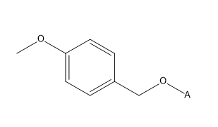

# How to generate a SMILES for an abbreviation?

- Draw the substructure/protective group you want to abbreviate as a normal structure in ChemDraw; for example the p-Methoxybenzyl (PMB) protective group: </br>
    
- Add an 'any atom' at the position where the protective group will be connected to the main structure: </br>
    
- Select the protective group: </br>
    
- Click on </br>
    "Edit" → "Copy As" → "SMILES" </br>
This will add the SMILES to the clipboard and it can be pasted via "Ctrl + V" or right mouse button → "Paste":
COC1=CC=C(CO[*])C=C1
- The SMILES can then be added to the abbreviations list, together with its abbreviation: </br>
    ```PMB COC1=CC=C(CO[*])C=C1```