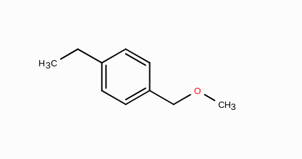
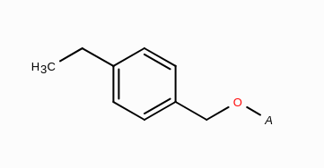
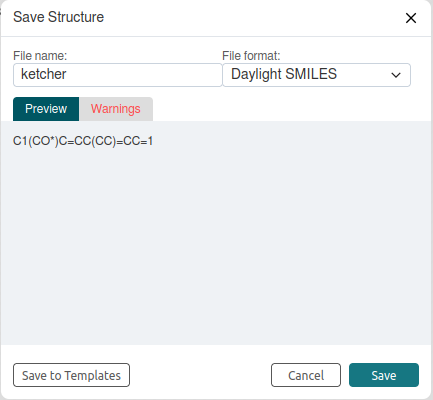

# How to generate a SMILES for an abbreviation using Ketcher?

- Draw the substructure/protective group you want to abbreviate as a normal structure in Ketcher; for example the p-Methoxybenzyl (PMB) protective group: </br>
    
- Add an 'any atom'at the position where the protective group will be connected to the main structure: </br>
    
- Click on "Save as..." → select "Daylight SMILES" in "File format": </br>
    
- Select and copy the SMILES via "Ctrl + C" or right mouse button → "Copy", </br> so it can be pasted via "Ctrl + V" or right mouse button → "Paste":</br>
C1(CO*)C=CC(CC)=CC=1
- The SMILES can then be added to the abbreviations list, together with its abbreviation: </br>
    ```PMB C1(CO*)C=CC(CC)=CC=1```