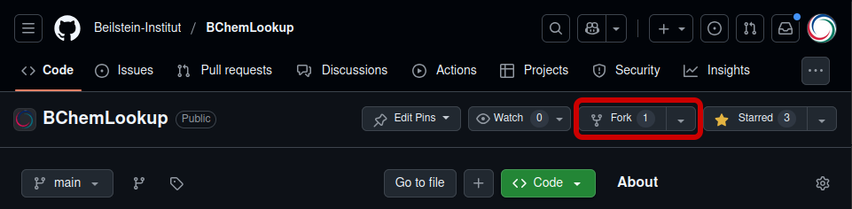
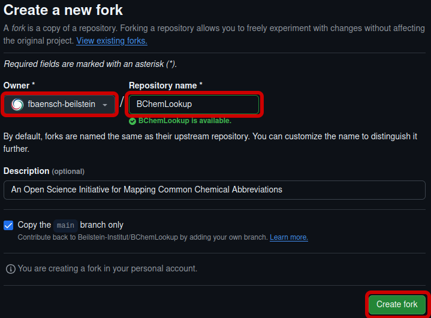
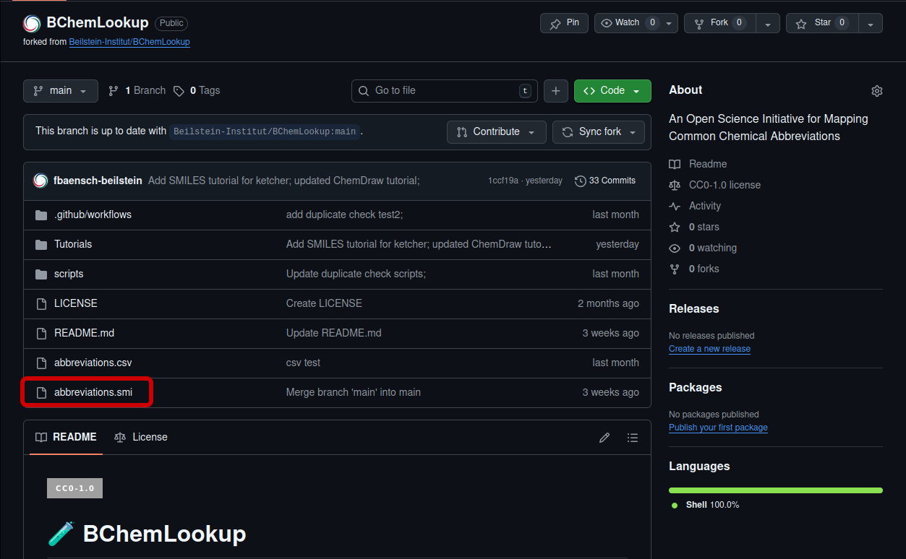
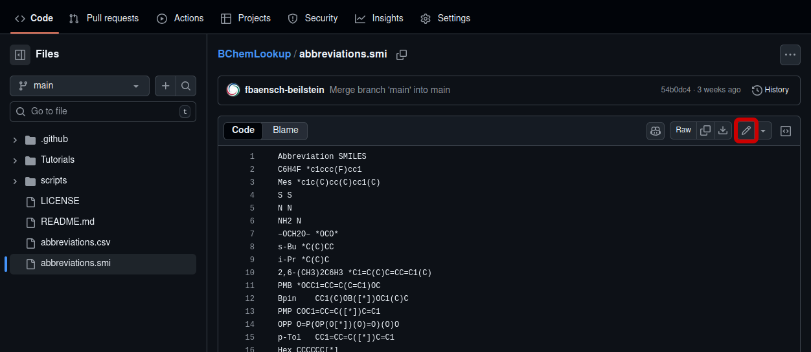
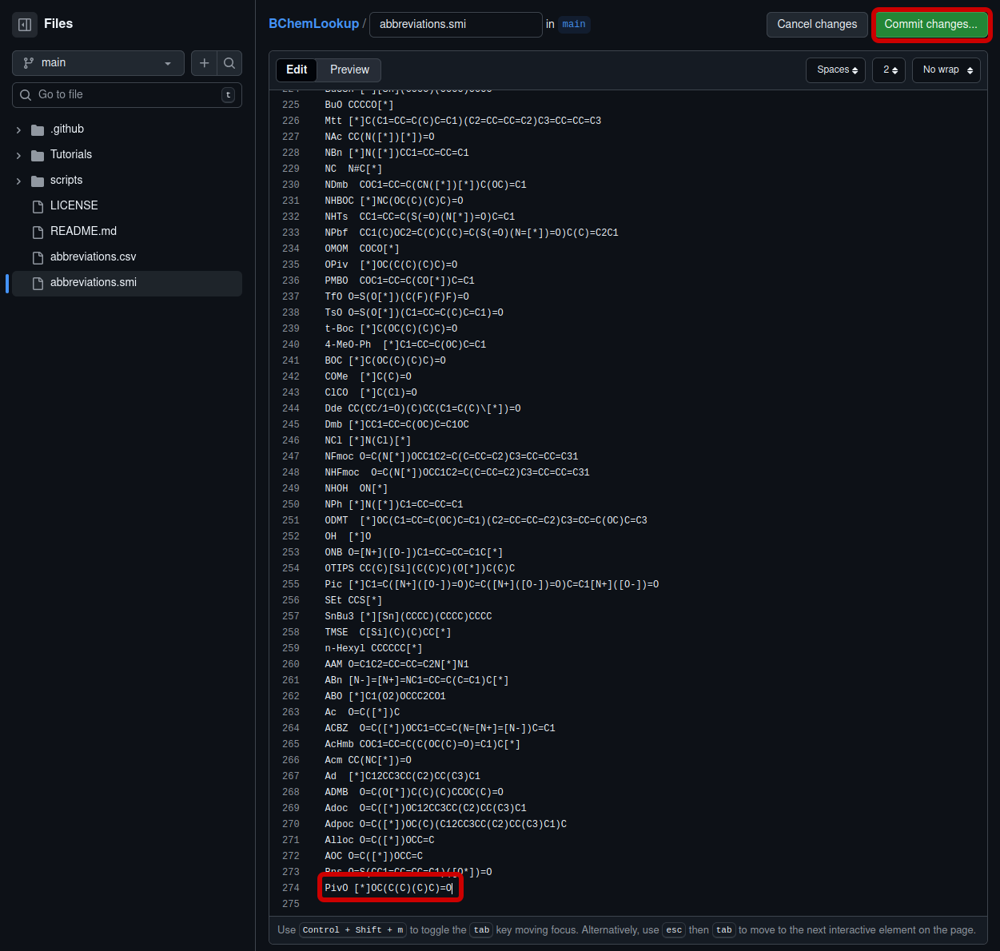
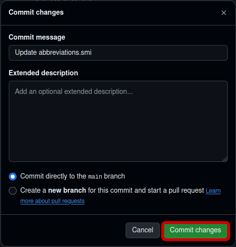
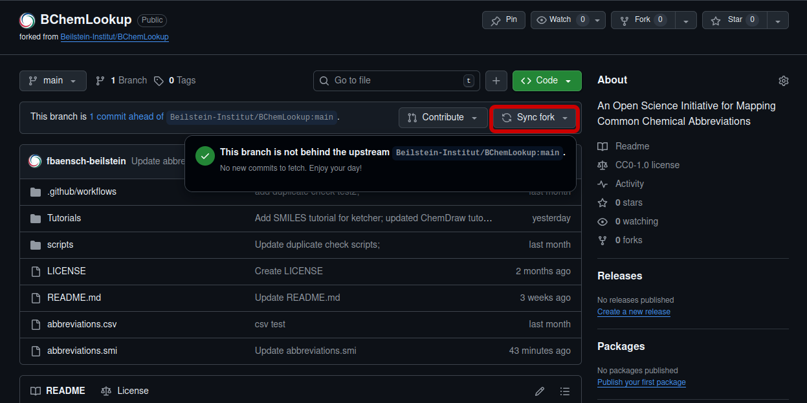
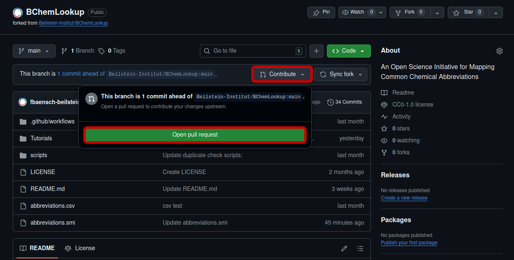
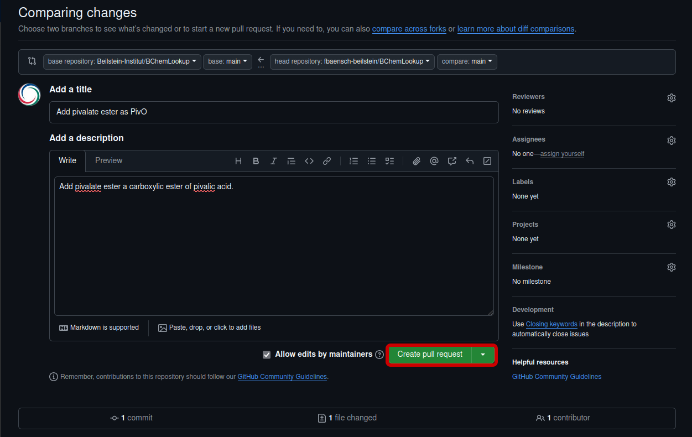

# How to create a Pull Request

This tutorial shows how to contribute to this project by creating a "Pull request".

## Fork the repository

- First you need a GitHub account, see [Creating an account on GitHub] (https://docs.github.com/en/get-started/start-your-journey/creating-an-account-on-github) for more details.
- On GitHub, navigate to the [ChemLookup](https://github.com/Beilstein-Institut/BChemLookup) repository. Click the `Fork` button in the top right corner:

- Select an owner for the forked repository in the dropdown menu under "Owner" and type a name under "Repository name" if you do not wish to use the same name which is set by default, then click `Create fork` in the bottom right corner:

## Working in browser

- In the forked repository, select the list to which you wish to contribute, for example `abbreviations.smi`:

- Click on `Edit this file` (small pen icon) in the top right corner:

- Add a new abbreviation or multiple ones and click `Commit changes...` in the top right corner:

- Type in a "commit message" and click `Commit changes`:

## Contribute or create a pull request

The branch of your forked respository is now ahead of the the branch of the origin repository. Now you can create pull request.

-First, make sure your branch is not behind the origin repository. Therefore click `Sync fork`. If everything is fine it will state:  
    "This branch is not behind the upstream Beilstein-Institut/BChemLookup:main":

- To contribute click `Contribute` and `Open pull request`:

- Add a title for your pull request and a description. In the description please include a short description or common use of your changes and state the source of the data. Then click `Create pull request`:

And you are done!
